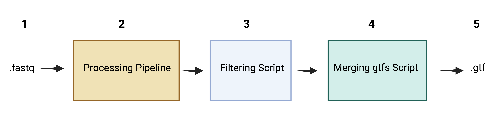

# Improving gene annotation with R2C2

## Abstract 

We applied Oxford Nanopore R2C2 sequencing to cortical organoids from human, chimpanzee, rhesus macaque, and marmoset to extend transcript representations in reference annotations.  Consensus correction significantly reduced error rates and improved read quality. Isoform reconstruction with most common tools - Mandalorion and FLAIR revealed complementary strengths of the two published methods, with Mandalorion capturing more novel isoforms and FLAIR favoring reference-concordant models. After SQANTI3-based filtering, thousands of high-confidence isoforms were retained, dominated by alternative transcript ends and supported by orthogonal data and targeted PCR validation. Incorporating these isoforms into annotations enhanced transcription start site signal in ATAC-seq and improved short-read gene assignment, reducing unannotated read fractions. Beyond providing a resource of improved annotations, this work illustrates both the challenges of long-read transcriptomics and the potential of in-house  efforts to advance gene annotation in underrepresented species such as non-human primates.

# Main steps to reproduce the workflow 

1. Input concatenated Nanopore fastqs: "/work/vstorozhuk/data/concatenated/" (not publically deposited)
2. Snakemake files and config to run pipeline at different isoform support levels (s1,s2,s3) [Scripts folder](Snakemake_to_reconstruct_isoforms/)
3. Script to read pipeline output and filter all isoforms [Scripts file](Scripts_for_analysis_of_isoforms/Script_to_filter_isoforms.Rmd)
4. Scripts to add SQANTI3-filtered isoforms supported by at least 2 long reads from Mandalorion to the default gtf per species [Scripts folder](Scripts_for_merging_gtfs_and_qc/)
5. Final merged gtfs were copied to: "/work/vstorozhuk/final_references/" (not publically deposited)

## Summary of all scripts
- Script to fetch short‐read data into folder and create fofn for SQANTI3 RNA-Seq support [Script file](Short_Reads/recreate_short_read_data_folder.sh)
- Yamls to reproduce creating lift over chain files [Script folder](CAGE/)
- Script to do reciprocal lift over to get CAGE peaks for all species [Script file](CAGE/LiftOver_CAGE.Rmd)
- Scripts for explorative analysis of the discovered isoforms [Scripts file](Scripts_for_analysis_of_isoforms/plot_overall_isoform_statistics.Rmd)

## R2C2 Approach Increased Adaptor Recognition and Reduced Error Rate in Nanopore Long Reads 

## Read Processing is Wrapped in Snakemake Pipeline 

## Extended reference improved ATAC-Seq TSS-signal and reduced N_noFeature mapping metric 